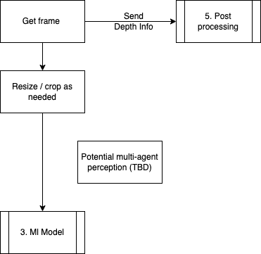
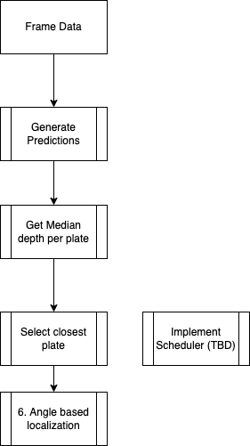

# CV Detection

## Overview

The CV systems have a basic pipeline that they follow a basic series of steps to operate. We will go over each of the steps one by one.

### Steps 1 and 2

For the first two steps (Input data and Pre-processing), we are getting a basic series of frames from the camera. The code then resizes/crops the photo if needed. After, the processed frame is sent to the ML model. In the future, we might add extra systems (aka other AI agents) that also get the data to improve the accuracy. In addition, some of the depth data is later sent to post-processing to get how far away objects are.

### Steps 3, 4, and 5

First step, we are getting the data from step 2 and then sending it to the algorithm to generate predictions (step 3). This will give us a list of armor plates found by the ML model. Next, we are doing feature extraction where we get the median depth per plate that we detected in step 3. We are getting the median depth to cut out noise from the depth camera. For example, in the image below, you can see how there is a lot of random color changes on surfaces (e.g. the red randomly changes to orange in some areas) that are about the same distance away. The goal of getting the median depth is to prevent this noise from affecting the measurements. By getting the median depth, we can ignore the noise and get a pretty good estimate of how far away an object is.

After getting the median, we are going to see which armor plate median in the lowest which would indicate that it's the closest armor plate. This closest armor plate will have its coordinates on the image sent to step 6, which does aiming. The median depth from step 1 is also sent alongside the coordinates. The process of sending the coordinates / depth info will possibly be used with a scheduler to basically "schedule" sending all the coordinates to make sure everything is processed on time.

### Step 6 and 7

For step 6, we take the box coordinates and median depth to calculate the yaw and pitch for the robot's shooting system. There might be an offset added to account for the fact that the camera is not perfectly aligned with where the ammo comes out. In addition, a timestamp is added just so that we can debug to figure out when instructions are coming into the Robomasters microcontroller in order. Finally, the data is sent out a tuple in the format of `(yaw, pitch, timestamp)`.