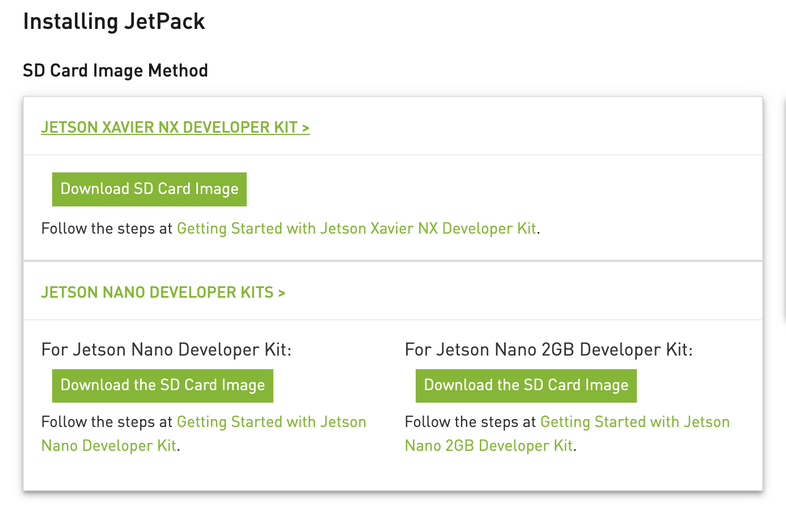
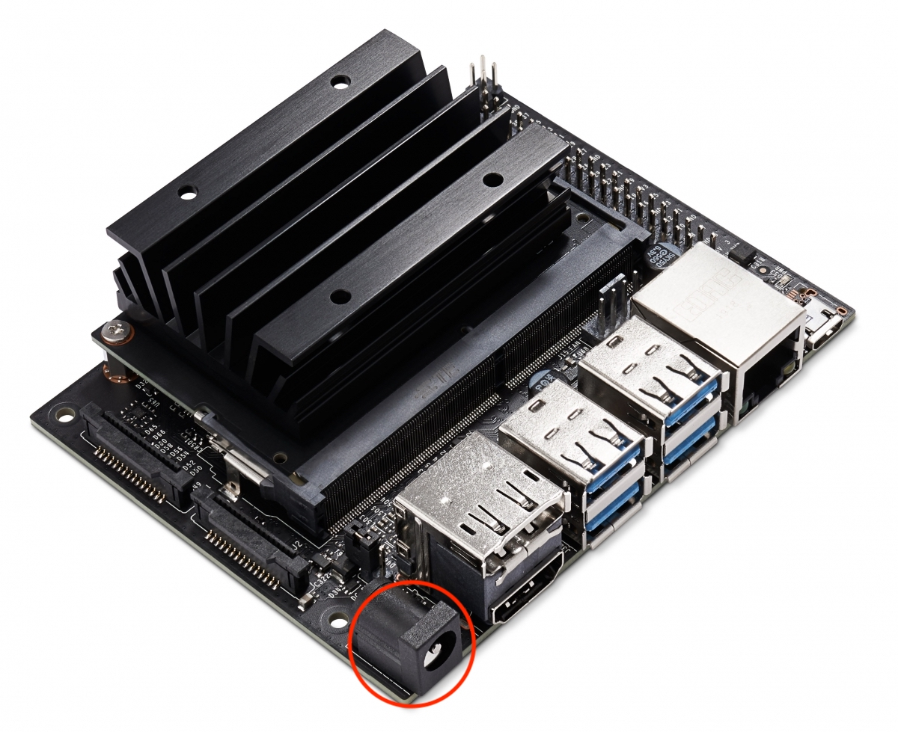
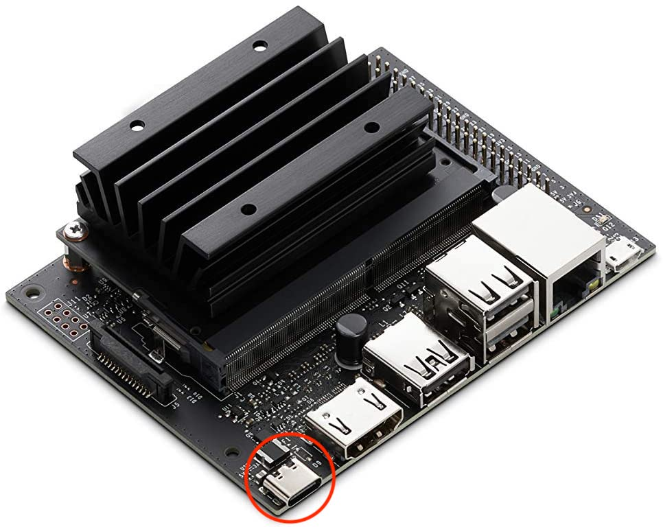
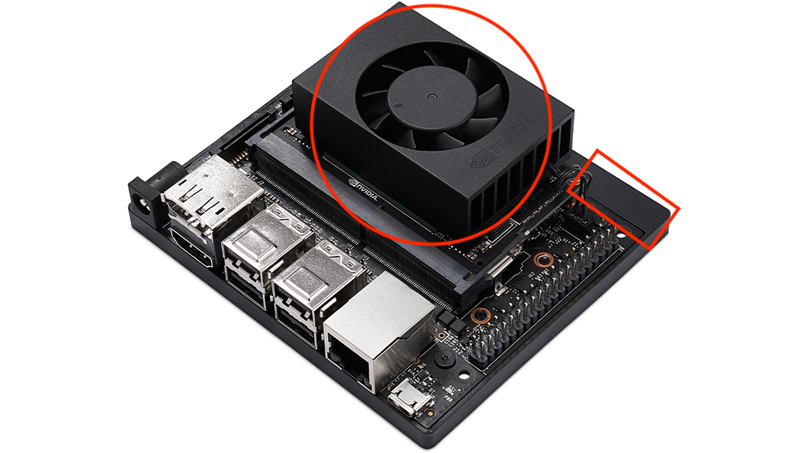

# Setup Jetsons

## Step 1 (Download Operating System)
[Download OS Here](https://developer.nvidia.com/jetpack-sdk-461)

To download the operating system, go to the webpage above and click ""Download the SD Card Image" for your Jetson type. **Do not download the SDK Manager.** There are multiple types of Jetsons so make sure to download the correct version for each Jetson.

### Regular Jetson Nano

This is the regular Jetson Nano. You can tell it is the regular version because it has a power barrel instead of USB-C. If this is the Jetson version you have then make sure to download the non-2GB OS image.

### 2 GB Jetson Nano

This is the 2 GB Jetson Nano. You can tell it is a 2 GB version because it has a USB-C port for power instead of a power barrel. If this is the Jetson version you have then make sure to download the 2 GB OS image.

### Jetson Xavier NX

This is the Jetson Xavier NX. You can tell this because it has a fan mounted on top by default. However, sometimes the Jetson Nanos can have a fan optionally installed. The other giveaway that it is an Xavier is that there is a plastic border around it (highlighted with a red square above). You can also check the model information on the underside of the board if you are not sure. If you are using a Jetson Xavier NX, then make sure to download the Xavier NX OS image.

## Step 2 (Format SD Card)

### Windows

1. Download, install, and then launch [SD Memory Card Formatter for Windows](https://www.sdcard.org/downloads/formatter_4/eula_windows/)
2. Select card drive
3. Select “Quick format”
4. Leave “Volume label” blank
5. Click “Format” to start formatting, and “Yes” on the warning dialog
6. Wait for it to finish

### MacOS
